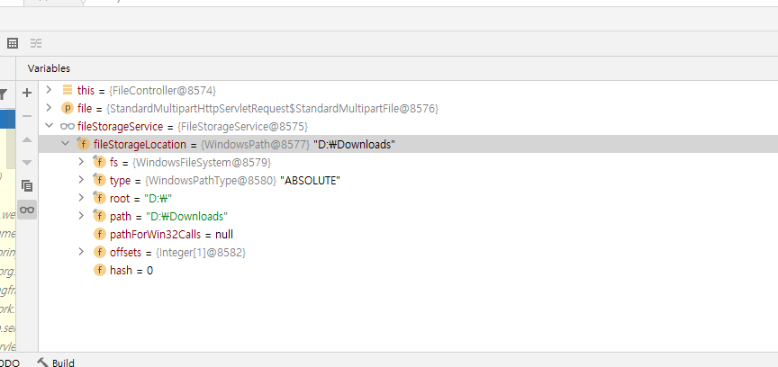
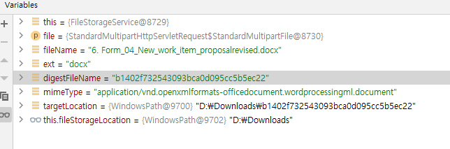
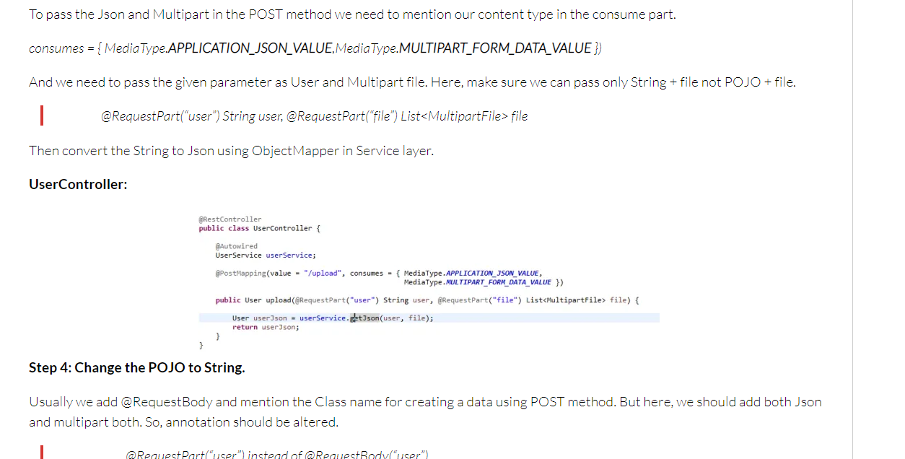

ifndef::snippets[]
:snippets: ./build/generated-snippets
endif::[]

= Rest Docs Sample API Document
goodjwon
:doctype: book
:icons: font
:source-highlighter: highlightjs
:toc: left
:toclevels: 4
:sectlinks:

[[introduction]]
== 소개

S2B FileApi Spring Rest Docs API

[[overview]]
= 개요

[[overview-http-verbs]]
== HTTP 동사

본 REST API에서 사용하는 HTTP 동사(verbs)는 가능한한 표준 HTTP와 REST 규약을 따릅니다.

|===
| 동사 | 용례

| `GET`
| 리소스를 가져올 때 사용

| `POST`
| 새 리소스를 만들 때 사용

| `PUT`
| 기존 리소스를 수정할 때 사용

| `PATCH`
| 기존 리소스의 일부를 수정할 때 사용

| `DELETE`
| 기존 리소스를 삭제할 떄 사용
|===

[[overview-http-status-codes]]
== HTTP 상태 코드

본 REST API에서 사용하는 HTTP 상태 코드는 가능한한 표준 HTTP와 REST 규약을 따릅니다.

|===
| 상태 코드 | 용례

| `200 OK`
| 요청을 성공적으로 처리함

| `201 Created`
| 새 리소스를 성공적으로 생성함. 응답의 `Location` 헤더에 해당 리소스의 URI가 담겨있다.

| `204 No Content`
| 기존 리소스를 성공적으로 수정함.

| `400 Bad Request`
| 잘못된 요청을 보낸 경우. 응답 본문에 더 오류에 대한 정보가 담겨있다.

| `404 Not Found`
| 요청한 리소스가 없음.
|===

[[overview-errors]]
== 오류

에러 응답이 발생했을 때 (상태 코드 >= 400), 본문에 해당 문제를 기술한 JSON 객체가 담겨있다. 에러 객체는 다음의 구조를 따른다.

[[common]]
== 공통 사항

API에 관계없이 아래 사항을 지켜주셔야 합니다.

=== Domain

|===
| 환경 | domain

| 개발서버
| `ts1apis.s2b.kr`

| 운영서버
| `apis.s2b.kr`
|===

=== Header

|===
| name | 설명

| `Authorization`
| API를 사용하기 위한 인증 키
|===

=== 공통 Response Body

|===
| field | 설명

| `code`
| 응답 코드

| `message`
| 예외사항 내용 등 응답 메세지

| `data`
| 실제 반환될 데이터
|===

[[users]]
== S2B FileManager Apis

=== 사용자 생성 요청 (Request)
[[create-file]]
==== file 생성

`POST (mutilty part)` 요청을 사용해서 파일을 업로드 할 수 있다.

CURL:

operation::upload-file[snippets='request-part-metadata-fields,curl-request,http-response,links']

include::{snippets}/upload-file/curl-request.adoc[]

Request Parameters:

include::{snippets}/upload-file/request-part-metadata-fields.adoc[]

Request HTTP Example:

include::{snippets}/upload-file/http-request.adoc[]

=== 사용자 생성 응답 (Response)

Response Fields:

include::{snippets}/upload-file/http-response.adoc[]

Response HTTP Example:

include::{snippets}/upload-file/response-body.adoc[]

=== 파일정보 조회

`Get` 요청을 사용해서 기존 이벤트 하나를 조회할 수 있다.

Request Field:
include::{snippets}/upload-file/request-fields.adoc[]

Response Body:

operation::upload-file[snippets='request-fields,curl-request,http-response,links']

* 파일업로드 및 정보 동시저장 추가
* https://blogs.perficient.com/2020/07/27/requestbody-and-multipart-on-spring-boot/

* 파일업로드 및 정보 동시저장 json post man test 방법 image::images/2021-05-21 08;21;53.PNG[]
